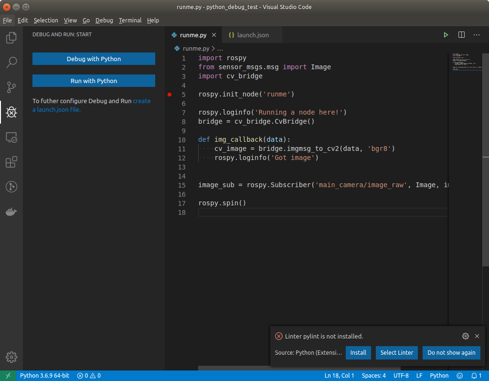
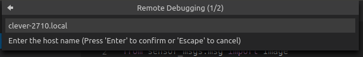
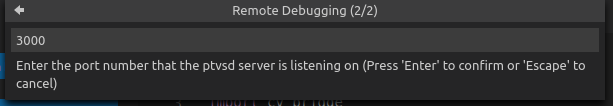
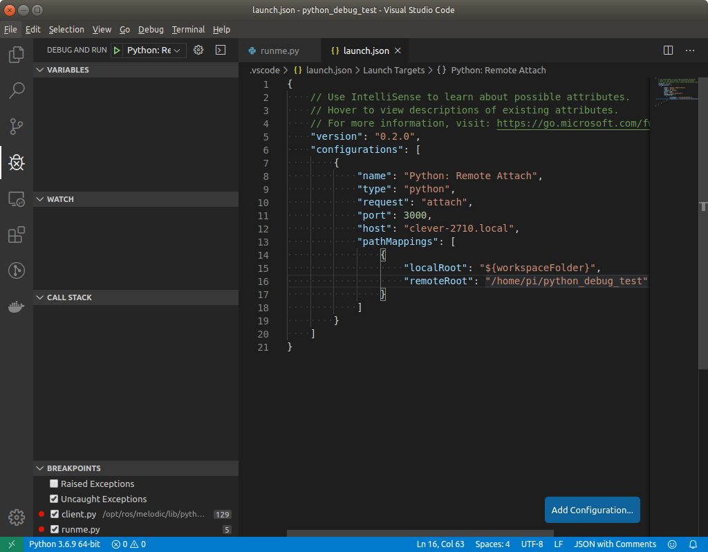
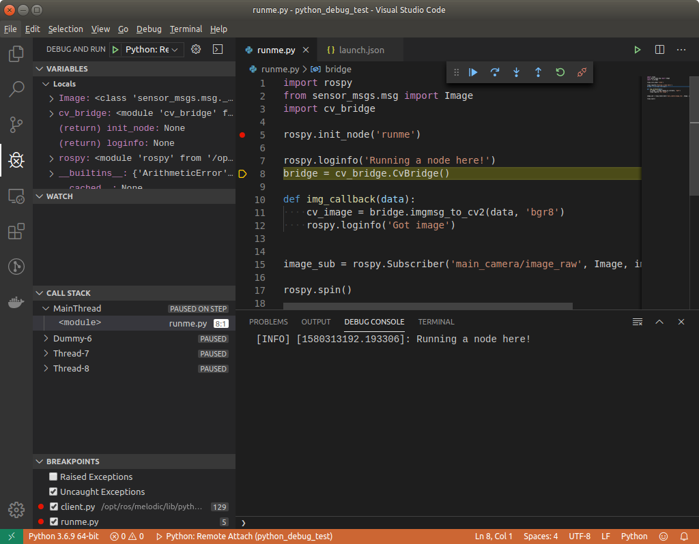
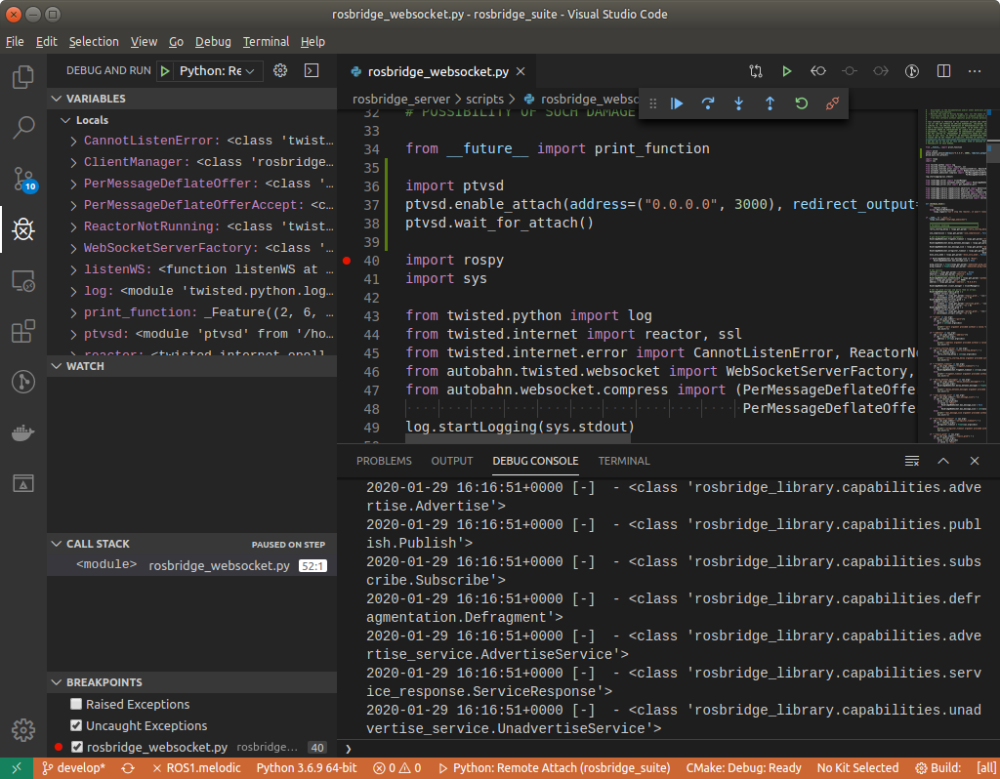

# Отладка скриптов на Python (в том числе удалённая)

Забавно, что для языка Python нет какого-то единого механизма отладки (или он есть, но не особо распространён). Различные среды программирования предлагают различные решения; здесь будет описан рабочий вариант для [Visual Studio Code](https://code.visualstudio.com/): [ptvsd](https://github.com/microsoft/ptvsd).

## Подготовка к запуску

Если отладка будет происходить удалённо, имеет смысл смонтировать удалённую файловую систему в локальную папку. Это можно сделать, например, с помощью пакета [`sshfs`](https://github.com/libfuse/sshfs) (обычно он есть в репозиториях). Чтобы смонтировать корень удалённой файловой системы, в командной строке надо выполнить:

```bash
sshfs username@host.local:/ /path/to/empty/directory
```

Вместо `/path/to/empty/directory` надо указать путь к пустой локальной директории. В зависимости от настроек ssh, возможно, придётся ввести пароль пользователя `username` от хоста `host.local`.

На всех системах, участвующих в процессе, надо установить `ptvsd` - желательно и для Python2, и для Python3. Это можно сделать через [`pip`](https://pypi.org/project/pip/):

```bash
sudo python -m pip install ptvsd # Python2
sudo python3 -m pip install ptvsd # Python3
```

В Visual Studio Code надо произвести настройку подключения отладчика. Сделать это надо один раз (для каждой системы/папки, в которой будет скрипт/пакет), но делать это придётся "руками":

1. Открываем VS Code, открываем папку, в которой хранится наш скрипт (или пакет, который мы собираемся отлаживать) - здесь очень хорошо подойдёт монтирование удалённой файловой системы.
2. Открываем панель отладчика:
    
3. Жмём "**Create a launch.json file**".
4. В выпавшем списке выбираем "**Remote attach**".
5. Вводим IP/hostname системы, на которой будет происходить отладка (если отладка идёт локально - вводим localhost)
    
6. Вводим порт, по которому отладчик будет подключаться (например, 3000):
    
7. Откроется файл launch.json, в котором наши hostname и port будут записаны. Здесь имеет смысл указать, например, path mappings: в remote root надо прописать путь к папке со скриптом/пакетом на удалённой системе:
    

После этого среда программирования сможет подключаться к отладчику.

## Запуск скрипта и подключение отладчика

Если скрипт запускается тривиально (то есть запуск осуществляется простым `python myscript.py` или `python3 myscript.py`), то на той системе, на которой будет происходить запуск, надо выполнить:

```bash
python -m ptvsd --host 192.168.0.15 --port 3000 --wait myscript.py
```

Опция `--host` указывает, откуда будет происходить подключение отладчика (здесь можно указать `0.0.0.0` - тогда подключение будет ожидаться отовсюду, но **это небезопасно**). `--wait` означает, что программа не будет запущена до тех пор, пока отладчик не подключится (чаще всего это желаемое поведение, но случаи разные бывают).

После запуска этой команды можно подключаться к запущенному скрипту:



## Подключение к ROS-ноде на Python

ROS-ноды, как правило, запускаются через `roslaunch`. Менять launch-файлы для запуска ноды через `python -m ptvsd` не всегда удобно; вместо этого можно добавить в начало скрипта запуска строчки:

```python
import ptvsd
ptvsd.enable_attach(address=("192.168.0.15", 3000), redirect_output=True)
ptvsd.wait_for_attach()
```

Здесь в `address` передаётся пара "хост-порт" (аналогично параметрам `--host` и `--port` в команде выше). `ptvsd.wait_for_attach()` остановит выполнение скрипта до тех пор, пока не произойдёт подключение VSCode.


