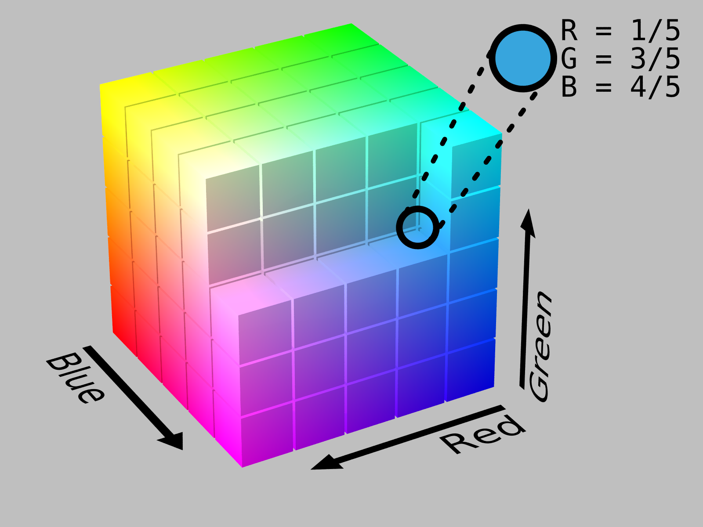
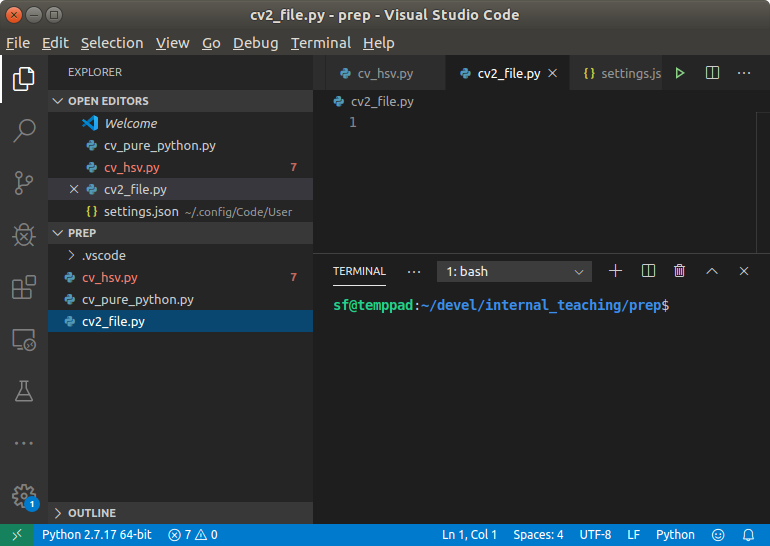
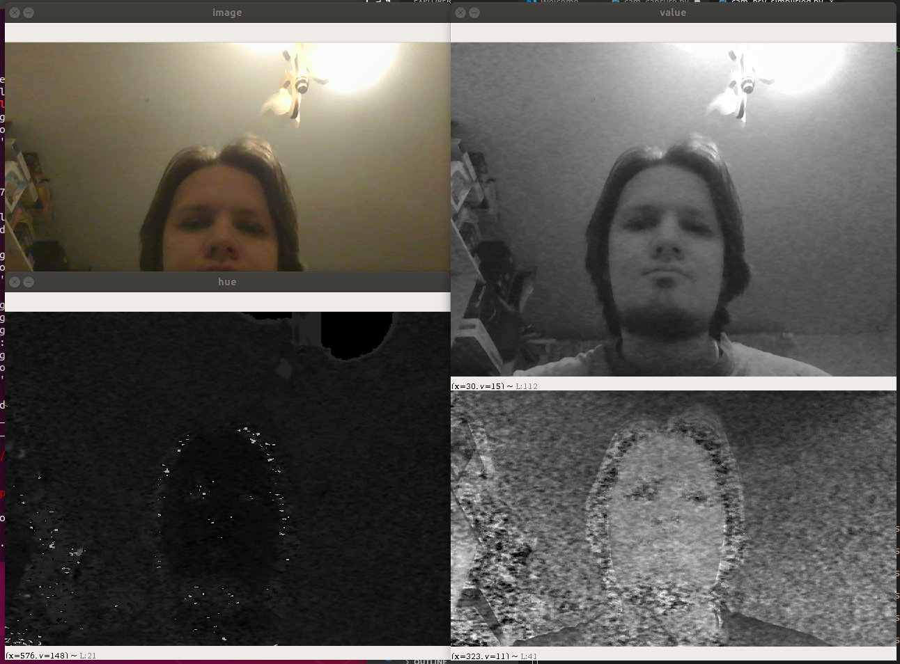
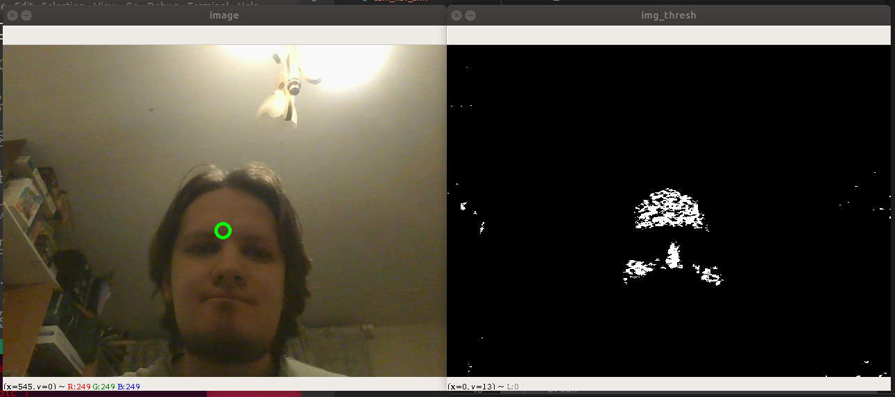
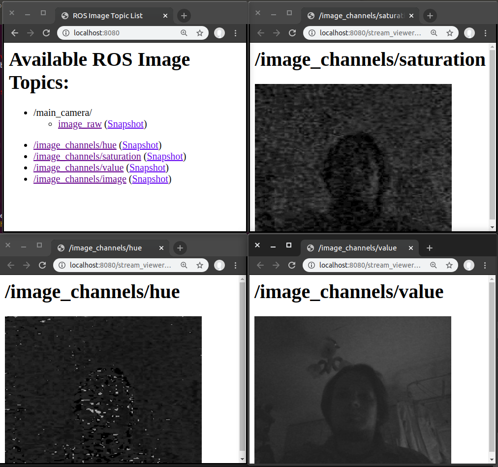

# Работа с OpenCV через Python

Здесь я оставлю краткие заметки по тому, что рассказывал коллегам. Эта заметка не претендует на звание учебного материала, но какую-то идею про то, что мы делали, дать может.

Документ получился несколько больше, чем я ожидал, поэтому вот попытка сделать оглавление:

1. [День 1](#day1)
    1. [Теория](#theory1)
    2. [Практика](#practice1)
        1. [Подготовка](#prep1)
        2. [Чтение изображения с камеры (OpenCV-style)](#cam_opencv)
        3. [Цветовые пространства](#cvt_color)
        4. [Бинаризация изображения](#in_range)
        5. [Центр области](#moments)
        6. [Морфологические операции](#morphology)
        7. [Интеграция с ROS](#ros_integration)
2. [День 2](#day2)

## <a id="day1"></a> День 1

### <a id="theory1"></a> Теория

OpenCV позволяет работать прежде всего с [растровыми изображениями](https://ru.wikipedia.org/wiki/%D0%A0%D0%B0%D1%81%D1%82%D1%80%D0%BE%D0%B2%D0%B0%D1%8F_%D0%B3%D1%80%D0%B0%D1%84%D0%B8%D0%BA%D0%B0). Изображения в данном случае представляются в виде двумерной матрицы, элементами которой являются либо числа (если изображения монохромны), либо вектора размерности 3 или 4 (в случае цветных изображений).

> "Вектор размерности 4" (то есть 4 числа) применяется для изображений с частично или полностью прозрачными участками.

Числа в этих векторах могут означать различные величины в зависимости от используемого [цветового пространства](https://ru.wikipedia.org/wiki/%D0%A6%D0%B2%D0%B5%D1%82%D0%BE%D0%B2%D0%BE%D0%B5_%D0%BF%D1%80%D0%BE%D1%81%D1%82%D1%80%D0%B0%D0%BD%D1%81%D1%82%D0%B2%D0%BE). OpenCV по умолчанию использует цветовое пространство BGR (по сути, [RGB](https://ru.wikipedia.org/wiki/RGB), только первым идёт синий цвет); цвет в данном пространстве "удобно" (ну, для математиков) представлять в виде координаты в трёхмерном пространстве:



(картинка взята [из Википедии](https://en.wikipedia.org/wiki/Color_spaces_with_RGB_primaries))

В OpenCV каждая компонента цвета кодируется числом от 0 до 255 (это как раз минимальное и максимальное значения, котороые может принимать 8-битное беззнаковое число - 8-bit unsigned integer, `uint8`)

Для задач выделения объекта по цвету зачастую удобнее использовать другое цветовое пространство - [HSV](https://ru.wikipedia.org/wiki/HSV_(%D1%86%D0%B2%D0%B5%D1%82%D0%BE%D0%B2%D0%B0%D1%8F_%D0%BC%D0%BE%D0%B4%D0%B5%D0%BB%D1%8C)) (hue, saturation, value - оттенок, насыщенностЬ, значение). В этом случае цвет (тройка чисел) задаётся как точка в цилиндрической системе координат:


(картинка взята [из Википедии](https://en.wikipedia.org/wiki/HSL_and_HSV))

Как видно из этого изображения, hue - угловая координата и, по идее, должна изменяться от 0 до 360 градусов (или от 0 до 2*PI, или от -PI до PI - в общем, так, как и положено полярным координатам). Однако в OpenCV эта величина изменяется от 0 до 180 - для того, чтобы "попасть" в диапазон от 0 до 255. Получается, что одна "единица" OpenCV'шного hue соответствует двум "градусам" "обычного".

Почему нам важны эти самые цветовые пространства? В общем-то, потому, что OpenCV позволяет нам быстро получить чёрно-белое (бинаризованное) изображение, в котором белые точки будут соответствовать цветам, вошедшим в заданный диапазон. Диапазон же надо задавать как набор минимальных и максимальных значений по каждому из трёх чисел. Если в цветовом пространстве RGB не очень понятно, как выделить нужный "кубик", то в HSV всё несколько проще: указываем, какой диапазон оттенков нас интересует, насыщенность и яркость подбираем так, чтобы было минимальное количество ложных точек.

Ещё одна вещь, которую стоит запомнить, - в OpenCV ось X изображения направлена слева направо, ось Y - сверху вниз (а не снизу вверх!). Точка с координатами `(0, 0)` находится в верхнем левом углу изображения.

### <a id="practice1"></a> Практика

Для практики, конечно, в идеале надо иметь компьютер с дистрибутивом Linux (например, Ubuntu 18.04) и установленным ROS. К Windows (и уж тем более к macOS) я был несколько не готов, но именно это и было на компьютерах слушателей.

#### <a id="prep1"></a> Подготовка

Первым делом надо поставить себе [Python 2.7](https://www.python.org/downloads/release/python-2717/) и [Visual Studio Code](https://code.visualstudio.com/). Далее надо поставить себе OpenCV; проще всего это сделать через утилиту `pip` (хотя это и не совсем правильно). В Windows (я предполагаю, что Python поставился в папку `C:\python27`) надо выполнить следующее:

```cmd
cd C:\python27\Scripts
pip.exe install opencv-contrib-python==3.4.8.29
```

В macOS надо сначала [поставить `pip`](https://pip.pypa.io/en/stable/installing/), затем выполнить:

```bash
pip install opencv-contrib-python==3.4.8.29
```

> Увы, иногда этого недостаточно. В некоторых случаях сначала придётся прописать путь к `pip` в переменной окружения `PATH`, да и Visual Studio Code будет ругаться на неправильный интерпретатор.

В Visual Studio Code очень стоит поставить расширение для работы с Python:


Далее надо открыть какую-нибудь рабочую папку, а в ней открыть и сохранить файл с расширением `.py`:



Слева внизу будет показан текущий интерпретатор Python. Нам нужен тот, который версии 2.7, поэтому если там выбрана другая версия, надо на неё нажать и выбрать нужную.

#### <a id="cam_opencv"></a> Чтение изображения с камеры (OpenCV-style)

Самая простая программа, показывающая изображение с камеры, будет выглядеть так:

```python
# -*- coding: utf-8 -*-
# Загружаем библиотеку cv2 - это интерфейс к OpenCV, доступный из Python
import cv2
# Также загружаем библиотеку numpy. Изображения OpenCV представляются как
# объекты этой библиотеки. "as np" нужно для того, чтобы к этой библиотеке обращаться
# по имени "np", а не по полному "numpy".
import numpy as np

# Создаём объект захвата видео - он может брать поток как с камеры, так и из файла,
# но прямо сейчас нас интересует именно работа с "вебкой". Если камер несколько, то
# можно попробовать изменить 0 на другое число - "активизируется" другая камера:
cap = cv2.VideoCapture(0)

# Входим в цикл, в котором будем делать следующее:
#  - читать изображение;
#  - выводить изображение на экран;
#  - реагировать на нажатие клавиш.
while True:
    # В переменной res будет содержаться результат чтения (получилось/не получилось).
    # img - изображение, которое мы прочитали.
    res, img = cap.read()
    # Создадим окно и выведем туда наше изображение
    cv2.imshow('image', img)
    # Для того, чтобы в окне что-то появилось, надо вызвать cv2.waitKey(). Эта функция
    # будет ожидать нажатия на клавишу в течение указанного количества миллисекунд
    # (или бесконечно, если указать 0), а заодно даст указание всем окнам, созданным
    # через imshow, обновить своё содержимое.
    # Результат cv2.waitKey() - код нажатой клавиши или -1, если ничего нажато не было.
    # Будем ждать 13 миллисекунд - это чуть меньше, чем 16 мс, проходящие между
    # кадрами при 60 FPS, но и мы в цикле не только ждём.
    if cv2.waitKey(13) > 0:
        # Выходим из цикла, если пользователь хоть что-то нажал
        break
```

Запустить программу можно нажатием на зелёный треугольник в окне Visual Studio Code.

#### <a id="cvt_color"></a> Цветовые пространства

Теперь попробуем перевести изображение в другое цветовое пространство - например, HSV. Для этого в OpenCV есть функция `cv2.cvtColor()`. Она принимает как минимум два параметра: исходное изображение и константу, указывающую, какое преобразование следует произвести. Эти константы начинаются с `cv2.COLOR_` и содержат описание преобразования (например, `cv2.COLOR_RGB2HLS`).

> Важный момент: по умолчанию OpenCV использует цветовое пространство BGR, и изображения, захваченные с камеры, закодированы именно так. Следовательно, для перевода в пространство HSV надо использовать константу `cv2.COLOR_BGR2HSV`.

```python
# -*- coding: utf-8 -*-
# Для простоты копирования я буду повторять всё, что есть в предыдущей программе,
# за исключением комментариев
import cv2
import numpy as np

cap = cv2.VideoCapture(0)
while True:
    res, img = cap.read()
    cv2.imshow('image', img)
    # Переведём наше изображение в цветовое пространство HSV:
    img_hsv = cv2.cvtColor(img, cv2.COLOR_BGR2HSV)
    # Здесь я сделаю немного не так, как рассказывал на занятии - вместо создания
    # пустого массива и его последующего заполнения я сразу выделю изображения
    # с нужными каналами. Синтаксис такого выделения довольно странный:
    hue = img_hsv[:,:,0]
    saturation = img_hsv[:,:,1]
    value = img_hsv[:,:,2]
    # - и, на мой взгляд, требует пояснения.
    # Вообще, в Python двоеточие в квадратных скобках позволяет делать срезы
    # - то есть, по сути, копию какого-то участка массива (списка).
    # Если перед двоеточием ничего нет - подразумевается, что срез начинается
    # с первого элемента, если ничего нет после - значит, заканчивается срез
    # на последнем элементе исходного массива.
    # Библиотека numpy следует этой идее, но позволяет производить срезы
    # сразу в нескольких измерениях. Так, img_hsv[100:200, 150:400] выделит
    # подматрицу из строк от 100й (включительно) до 200й (не включительно)
    # и столбцов от 150го (включительно) до 400го (не включительно). Срез же
    # img_hsv[:,:] выделит всю матрицу img_hsv.
    # Кстати, строки - это координаты по y, столбцы - координаты по x.
    #
    # Каждый из каналов покажем в отдельном окне. Отображаться они будут
    # в виде чёрно-белых изображений.
    cv2.imshow('hue', hue)
    cv2.imshow('saturation', saturation)
    cv2.imshow('value', value)
    if cv2.waitKey(13) > 0:
        break
```



#### <a id="in_range"></a> Бинаризация изображения

Выделим теперь ту часть изображения, которая входит в заданный цветовой диапазон. Границы этого диапазона можно подбирать экспериментально. Для нахождения точек, которые входят в заданный диапазон, можно использовать функцию `cv2.inRange()`: она создаёт матрицу с таким же количеством столбцов и строчек, как у исходной (то есть изображение такого же размера); элемент матрицы будет равен 255, если элемент исходной матрицы вошёл в заданный диапазон, и 0, если этот элемент не вошёл (то есть белые точки - те, что входят в диапазон цветов, чёрные - те, что не входят).

> Здесь хорошо бы напомнить, что в цветовом пространстве HSV ось H, вообще-то, "закольцована": красными будут как величины, близкие к 0, так и величины, близкие к 180. Поэтому, если надо распознавать красные предметы, придётся делать это в два прохода, и потом комбинировать результат.

```python
# -*- coding: utf-8 -*-
import cv2
import numpy as np

cap = cv2.VideoCapture(0)
while True:
    res, img = cap.read()
    cv2.imshow('image', img)
    img_hsv = cv2.cvtColor(img, cv2.COLOR_BGR2HSV)
    # Определим нижнюю и верхнюю границы диапазона цветов.
    # Будем писать код для определения красных предметов,
    # чтобы показать, как их определять в два прохода.
    color_low1 = (0, 100, 100)
    color_high1 = (15, 255, 255)

    color_low2 = (165, 100, 100)
    color_high2 = (180, 255, 255)

    img_thresh1 = cv2.inRange(img_hsv, color_low1, color_high1)
    img_thresh2 = cv2.inRange(img_hsv, color_low2, color_high2)

    # Посмотрим, что попало в каждый из диапазонов...
    cv2.imshow('img_thresh1', img_thresh1)
    cv2.imshow('img_thresh2', img_thresh2)
    # ...и объединим эти два изображения. Для объединения будем
    # использовать побитовое "или": если точка белая
    # хотя бы на одном изображении, она будет белой
    # на конечном.
    img_thresh = cv2.bitwise_or(img_thresh1, img_thresh2)
    cv2.imshow('img_thresh', img_thresh)

    if cv2.waitKey(13) > 0:
        break
```

#### <a id="moments"></a> Центр области

Наконец, вычислим "центр масс" белой области на финальном изображении. Для этого воспользуемся функцией `cv2.moments()`, высчитывающей различные "моменты" изображения (нам потребуются статические моменты) - подробнее о том, как они считаются, можно [почитать в документации OpenCV](https://docs.opencv.org/3.4.9/d8/d23/classcv_1_1Moments.html).

> Коротко: момент `m00` - просто сумма значений пикселей; `m01` - статический момент относительно оси `y`, `m10` - статический момент относительно оси `x`. Центр масс будет в точке (`m10` / `m00`, `m01` / `m00`) - "всё как в физике".

```python
# -*- coding: utf-8 -*-
import cv2
import numpy as np

cap = cv2.VideoCapture(0)
while True:
    res, img = cap.read()
    img_hsv = cv2.cvtColor(img, cv2.COLOR_BGR2HSV)
    color_low1 = (0, 100, 100)
    color_high1 = (15, 255, 255)

    color_low2 = (165, 100, 100)
    color_high2 = (180, 255, 255)

    img_thresh1 = cv2.inRange(img_hsv, color_low1, color_high1)
    img_thresh2 = cv2.inRange(img_hsv, color_low2, color_high2)
    img_thresh = cv2.bitwise_or(img_thresh1, img_thresh2)

    cv2.imshow('img_thresh', img_thresh)
    moments = cv2.moments(img_thresh)
    # Вполне возможно, что ничего в наш диапазон не попало.
    # В этом случае момент `m00` будет равен нулю, и делить
    # на него нельзя. Учтём это в наших расчётах.
    if moments["m00"] != 0.0:
        # Для рисования круга вокруг центра масс нам нужны
        # целочисленные координаты, поэтому результат деления
        # приводим к целым:
        cnt_x = int(moments["m10"] / moments["m00"])
        cnt_y = int(moments["m01"] / moments["m00"])
        # Рисуем окружность на исходном изображении. Параметры:
        # img - исходное изображение,
        # (cnt_x, cnt_y) - координаты центра окружности,
        # 10 - радиус окружности,
        # (0, 255, 0) - цвет круга (B=0, G=255, R=0 - зелёный)
        # 3 - толщина линии окружности
        img = cv2.circle(img, (cnt_x, cnt_y), 10, (0, 255, 0), 3)
    cv2.imshow('image', img)

    if cv2.waitKey(13) > 0:
        break
```



#### <a id="morphology"></a> Морфологические операции

Изображения, полученные в результате бинаризации, часто могут содержать "шум". Для избавления от него можно использовать можно использовать [морфологические операции](https://ru.wikipedia.org/wiki/%D0%9C%D0%B0%D1%82%D0%B5%D0%BC%D0%B0%D1%82%D0%B8%D1%87%D0%B5%D1%81%D0%BA%D0%B0%D1%8F_%D0%BC%D0%BE%D1%80%D1%84%D0%BE%D0%BB%D0%BE%D0%B3%D0%B8%D1%8F): эрозию (`cv2.erode()`) и наращивание (`cv2.dilate()`).

> Последовательное применение эрозии и наращивания называется размыканием (opening). Выполнить его можно с помощью операции `cv2.morphologyEx()`, более подробное описание [есть на OpenCV-Python Tutorials](https://opencv-python-tutroals.readthedocs.io/en/latest/py_tutorials/py_imgproc/py_morphological_ops/py_morphological_ops.html#opening).

```python
# -*- coding: utf-8 -*-
import cv2
import numpy as np

cap = cv2.VideoCapture(0)
while True:
    res, img = cap.read()
    img_hsv = cv2.cvtColor(img, cv2.COLOR_BGR2HSV)
    color_low1 = (0, 100, 100)
    color_high1 = (15, 255, 255)

    color_low2 = (165, 100, 100)
    color_high2 = (180, 255, 255)

    img_thresh1 = cv2.inRange(img_hsv, color_low1, color_high1)
    img_thresh2 = cv2.inRange(img_hsv, color_low2, color_high2)
    img_thresh = cv2.bitwise_or(img_thresh1, img_thresh2)

    cv2.imshow('img_thresh', img_thresh)

    # Будем избавляться от шума последовательным применением
    # операций erode и dilate. Для начала составим структурный
    # элемент этих операций ("ядро", kernel). Размер
    # структурного элемента влияет на то, насколько большие
    # области будут удалены.
    # Мы создадим квадратный структурный элемент размером 5*5
    # пикселей:
    kernel = np.ones((5, 5), dtype=np.uint8)
    # Теперь применим операцию эрозии. Заметим, что шума стало
    # меньше, но уменьшились и наиденные области.
    # В качестве параметров передаём бинаризованное изображение
    # и структурный элемент.
    img_thresh_eroded = cv2.erode(img_thresh, kernel)
    cv2.imshow('erode', img_thresh_eroded)
    # Для "восстановления" наиденных областей воспользуемся
    # операцией dilate. Здесь, кстати, "проявится" форма
    # структурного элемента.
    # В качестве параметров - бинаризованное изображение
    # и структурный элемент.
    img_thresh_dilated = cv2.dilate(img_thresh_eroded, kernel)
    cv2.imshow('dilate', img_thresh_dilated)

    # Дальнейшие операции будем производить уже с "восстановленным"
    # изображением.
    moments = cv2.moments(img_thresh_dilated)
    if moments["m00"] != 0.0:
        cnt_x = int(moments["m10"] / moments["m00"])
        cnt_y = int(moments["m01"] / moments["m00"])
        img = cv2.circle(img, (cnt_x, cnt_y), 10, (0, 255, 0), 3)
    cv2.imshow('image', img)

    if cv2.waitKey(13) > 0:
        break
```

#### <a id="ros_integration"></a> Интеграция с ROS

До сих пор мы писали код, который работает на компьютерах, где есть оконная система, а камеру использовала только одна программа (и эту программу пишем мы сами). В ROS же всё немного иначе:

* программа, скорее всего, выполняется на роботе (дроне), на котором и экрана-то нет;
* данные с одного датчика (например, камеры) могут обрабатываться несколькими программами одновременно;
* не все из этих программ пишем мы.

В ROS проблема совместного доступа к данным с датчиков решается механизмом Publisher/Subscriber. Для нас это означает, что захват изображения с камеры будет происходить не совсем так, как в "чистом" OpenCV. Для вывода изображений также будет использоваться публикация в ROS-топик вместо `imshow`. Обработка изображений будет одинаковой как в "чистом" OpenCV, так и в ROS.

Для начала повторим самый первый пример работы с камерой, но перепишем его для использования топиков:

```python
# -*- coding: utf-8 -*-
import cv2
import numpy as np
# Библиотека rospy обеспечивает взаимодействие нашей программы
# и остального окружения ROS. Она позволяет подписываться на топики,
# публиковать сообщения, вызывать сервисы.
import rospy
# Каждый раз, когда мы подписываемся на топик или хотим опубликовать
# свой, мы должны указывать тип сообщения в топике. В нашем случае
# это сообщение типа Image из пакета sensor_msgs:
from sensor_msgs.msg import Image
# Мы хотим работать с изображениями OpenCV, и сообщения ROS надо в них
# как-то превращать. Аналогично, если мы хотим публиковать изображения,
# нам надо их как-то превращать в сообщения ROS. В этом нам поможет
# библиотека cv_bridge:
from cv_bridge import CvBridge

# В начале нашей программы надо сделать несколько дополнительных
# телодвижений.
# Во-первых, надо зарегистрироваться в ROS и сказать, что мы -
# нода (узел) с указанным именем. Это делается вызовом
# rospy.init_node(), в качестве параметра передаётся наше имя.
rospy.init_node('image_loopback')
# Во-вторых, надо проинициализировать библиотеку cv_bridge.
# Все операции с ней будут происходить через объект CvBridge(),
# который мы создадим и назовём bridge. Конвертацию сообщений ROS
# в изображения OpenCV и обратно мы будем производить через него.
bridge = CvBridge()

# Далее, если мы хотим публиковать какие-то изображения, нам надо
# указать, куда мы будем это делать. Это делается при создании объекта
# rospy.Publisher(), который мы будем использовать для публикации
# изображений. При его создании надо передать в качестве параметров:
#  - имя топика с названием изображения (например, '~image').
#    Тильда в начале будет заменена на название ноды, и в результате
#    полное название топика будет "/image_loopback/image";
#  - тип топика (в данном случае - Image);
#  - queue_size=1 (чтобы не создавалась очередь сообщений на публикацию)
image_pub = rospy.Publisher('~image', Image, queue_size=1)

# Вместо создания объекта захвата (cap = cv2.VideoCaputre(0)) надо будет
# указать подписку на топик. Правда, сначала нам надо будет описать, как
# мы будем обрабатывать изображение.

# Вместо бесконечного цикла (while True:) объявляем функцию, которая
# будет обрабатывать изображение:
#while True:
def image_callback(data):
    #res, img = cap.read()
    img = bridge.imgmsg_to_cv2(data, 'bgr8')
    # Вместо cv2.imshow() будем использовать публикацию изображений:
    #cv2.imshow('image', img)
    image_pub.publish(bridge.cv2_to_imgmsg(img, 'bgr8'))
    # Никаких cv2.waitKey() нам не потребуется.

# Теперь, когда у нас есть обработчик, подписываемся на топик камеры.
# Параметры:
#  - имя топика с изображением (у основной камеры - main_camera/image_raw);
#  - ожидаемый тип сообщения (в данном случае - Image)
#  - функция, которую надо вызвать для обработки изображения (image_callback);
#  - размер очереди (имеет смысл всегда ставить 1)
image_sub = rospy.Subscriber('main_camera/image_raw', Image,
                             image_callback, queue_size=1)

# Входим в бесконечный цикл и ждём сообщений от камеры
rospy.spin()
```

Посмотреть изображение из топика можно через web_video_server.

> Стоит помнить, что публикация изображения - не бесплатная операция. Удобно что-то рисовать на изображении во время отладки, но следует предусмотреть отключение публикации, например, если на топик никто не подписан (то есть если `image_pub.gen_num_connections() == 0`).

## <a id="day2"></a> День 2

### <a id="practice2"></a> Практика

> По сути, в этот день мы ещё раз повторяли все операции над изображениями и переносили их на дрон. Из любопытного - чёрно-белые изображения (например, такие, которые получаются в результате бинаризации) надо конвертировать с форматом `mono8`.

#### <a id="multipub"></a> Публикация нескольких изображений

Если в OpenCV нам было достаточно вызвать функцию `cv2.imshow()` для того, чтобы у нас появилось новое окно, то в ROS для каждого изображения придётся делать свой publisher. Так, к примеру, если мы хотим публиковать раздельно каналы hue, saturation, value, то наш код получится примерно таким:

```python
# -*- coding: utf-8 -*-
import cv2
import numpy as np
import rospy
from sensor_msgs.msg import Image
from cv_bridge import CvBridge

rospy.init_node('image_channels')
bridge = CvBridge()

# Publisher для исходного изображения (просто чтобы понять,
# работает ли наш код);
image_pub = rospy.Publisher('~image', Image, queue_size=1)
# Publisher для канала оттенков
hue_pub = rospy.Publisher('~hue', Image, queue_size=1)
# Publisher для канала насыщенности
saturation_pub = rospy.Publisher('~saturation', Image, queue_size=1)
# Publisher для канала яркости
value_pub = rospy.Publisher('~value', Image, queue_size=1)

def image_callback(data):
    img = bridge.imgmsg_to_cv2(data, 'bgr8')
    img_hsv = cv2.cvtColor(img, cv2.COLOR_BGR2HSV)

    hue = img_hsv[:,:,0]
    saturation = img_hsv[:,:,1]
    value = img_hsv[:,:,2]

    image_pub.publish(bridge.cv2_to_imgmsg(img, 'bgr8'))
    # Для публикации одноцветного изображения указываем вторым параметром 'mono8'
    hue_pub.publish(bridge.cv2_to_imgmsg(hue, 'mono8'))
    saturation_pub.publish(bridge.cv2_to_imgmsg(saturation, 'mono8'))
    value_pub.publish(bridge.cv2_to_imgmsg(value, 'mono8'))

image_sub = rospy.Subscriber('main_camera/image_raw', Image,
                             image_callback, queue_size=1)

rospy.spin()
```

Просматривать изображения из этих топиков удобнее всего через `web_video_server`. Он доступен на дроне по адресу [http://192.168.11.1:8080](http://192.168.11.1:8080) (если дрон не переведён в режим клиента):



> На приведённой иллюстрации в адресной строке вместо 192.168.11.1 написано localhost - это потому, что я запустил ноды `web_video_server` и `cv_camera` у себя на компьютере, а не на дроне. Это можно сделать, но для этого нужна система на основе GNU/Linux.
