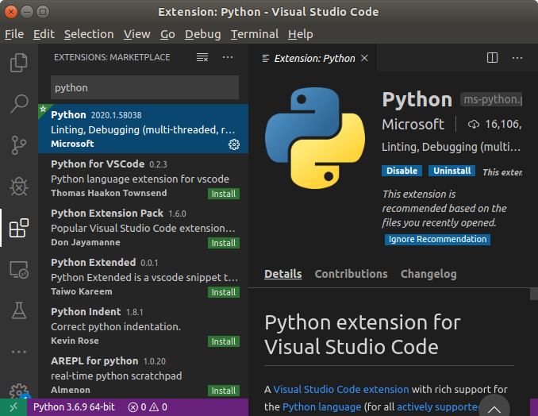

# Работа с OpenCV через Python

Здесь я оставлю краткие заметки по тому, что рассказывал коллегам. Эта заметка не претендует на звание учебного материала, но какую-то идею про то, что мы делали, дать может.

## День 1.

### Теория

OpenCV позволяет работать прежде всего с [растровыми изображениями](https://ru.wikipedia.org/wiki/%D0%A0%D0%B0%D1%81%D1%82%D1%80%D0%BE%D0%B2%D0%B0%D1%8F_%D0%B3%D1%80%D0%B0%D1%84%D0%B8%D0%BA%D0%B0). Изображения в данном случае представляются в виде двумерной матрицы, элементами которой являются либо числа (если изображения монохромны), либо вектора размерности 3 или 4 (в случае цветных изображений).

> "Вектор размерности 4" (то есть 4 числа) применяется для изображений с частично или полностью прозрачными участками.

Числа в этих векторах могут означать различные величины в зависимости от используемого [цветового пространства](https://ru.wikipedia.org/wiki/%D0%A6%D0%B2%D0%B5%D1%82%D0%BE%D0%B2%D0%BE%D0%B5_%D0%BF%D1%80%D0%BE%D1%81%D1%82%D1%80%D0%B0%D0%BD%D1%81%D1%82%D0%B2%D0%BE). OpenCV по умолчанию использует цветовое пространство BGR (по сути, [RGB](https://ru.wikipedia.org/wiki/RGB), только первым идёт синий цвет); цвет в данном пространстве "удобно" (ну, для математиков) представлять в виде координаты в трёхмерном пространстве:


(картинка взята [из Википедии](https://en.wikipedia.org/wiki/Color_spaces_with_RGB_primaries))

В OpenCV каждая компонента цвета кодируется числом от 0 до 255 (это как раз минимальное и максимальное значения, котороые может принимать 8-битное беззнаковое число - 8-bit unsigned integer, `uint8`)

Для задач выделения объекта по цвету зачастую удобнее использовать другое цветовое пространство - [HSV](https://ru.wikipedia.org/wiki/HSV_(%D1%86%D0%B2%D0%B5%D1%82%D0%BE%D0%B2%D0%B0%D1%8F_%D0%BC%D0%BE%D0%B4%D0%B5%D0%BB%D1%8C)) (hue, saturation, value - оттенок, насыщенностЬ, значение). В этом случае цвет (тройка чисел) задаётся как точка в цилиндрической системе координат:


(картинка взята [из Википедии](https://en.wikipedia.org/wiki/HSL_and_HSV))

Как видно из этого изображения, hue - угловая координата и, по идее, должна изменяться от 0 до 360 градусов (или от 0 до 2*PI, или от -PI до PI - в общем, так, как и положено полярным координатам). Однако в OpenCV эта величина изменяется от 0 до 180 - для того, чтобы "попасть" в диапазон от 0 до 255. Получается, что одна "единица" OpenCV'шного hue соответствует двум "градусам" "обычного".

Почему нам важны эти самые цветовые пространства? В общем-то, потому, что OpenCV позволяет нам быстро получить чёрно-белое (бинаризованное) изображение, в котором белые точки будут соответствовать цветам, вошедшим в заданный диапазон. Диапазон же надо задавать как набор минимальных и максимальных значений по каждому из трёх чисел. Если в цветовом пространстве RGB не очень понятно, как выделить нужный "кубик", то в HSV всё несколько проще: указываем, какой диапазон оттенков нас интересует, насыщенность и яркость подбираем так, чтобы было минимальное количество ложных точек.

Ещё одна вещь, которую стоит запомнить, - в OpenCV ось X изображения направлена слева направо, ось Y - сверху вниз (а не снизу вверх!). Точка с координатами `(0, 0)` находится в верхнем левом углу изображения.

### Практика

Для практики, конечно, в идеале надо иметь компьютер с дистрибутивом Linux (например, Ubuntu 18.04) и установленным ROS. К Windows (и уж тем более к macOS) я был несколько не готов, но именно это и было на компьютерах слушателей.

Первым делом надо поставить себе [Python 2.7](https://www.python.org/downloads/release/python-2717/) и [Visual Studio Code](https://code.visualstudio.com/). Далее надо поставить себе OpenCV; проще всего это сделать через утилиту `pip` (хотя это и не совсем правильно). В Windows (я предполагаю, что Python поставился в папку `C:\python27`) надо выполнить следующее:

```cmd
cd C:\python27\Scripts
pip.exe install opencv-contrib-python==3.4.8.29
```

В macOS надо сначала [поставить `pip`](https://pip.pypa.io/en/stable/installing/), затем выполнить:

```bash
pip install opencv-contrib-python==3.4.8.29
```

> Увы, иногда этого недостаточно. В некоторых случаях сначала придётся прописать путь к `pip` в переменной окружения `PATH`, да и Visual Studio Code будет ругаться на неправильный интерпретатор.

В Visual Studio Code очень стоит поставить расширение для работы с Python:



Далее надо открыть какую-нибудь рабочую папку, а в ней открыть и сохранить файл с расширением `.py`:


Слева внизу будет показан текущий интерпретатор Python. Нам нужен тот, который версии 2.7, поэтому если там выбрана другая версия, надо на неё нажать и выбрать нужную.

Самая простая программа, показывающая изображение с камеры, будет выглядеть так:

```python
# -*- coding: utf-8 -*-
# Загружаем библиотеку cv2 - это интерфейс к OpenCV, доступный из Python
import cv2
# Также загружаем библиотеку numpy. Изображения OpenCV представляются как
# объекты этой библиотеки. "as np" нужно для того, чтобы к этой библиотеке обращаться
# по имени "np", а не по полному "numpy".
import numpy as np

# Создаём объект захвата видео - он может брать поток как с камеры, так и из файла,
# но прямо сейчас нас интересует именно работа с "вебкой". Если камер несколько, то
# можно попробовать изменить 0 на другое число - "активизируется" другая камера:
cap = cv2.VideoCapture(0)

# Входим в цикл, в котором будем делать следующее:
#  - читать изображение;
#  - выводить изображение на экран;
#  - реагировать на нажатие клавиш.
while True:
    # В переменной res будет содержаться результат чтения (получилось/не получилось).
    # img - изображение, которое мы прочитали.
    res, img = cap.read()
    # Создадим окно и выведем туда наше изображение
    cv2.imshow('image', img)
    # Для того, чтобы в окне что-то появилось, надо вызвать cv2.waitKey(). Эта функция
    # будет ожидать нажатия на клавишу в течение указанного количества миллисекунд
    # (или бесконечно, если указать 0), а заодно даст указание всем окнам, созданным
    # через imshow, обновить своё содержимое.
    # Результат cv2.waitKey() - код нажатой клавиши или -1, если ничего нажато не было.
    # Будем ждать 13 миллисекунд - это чуть меньше, чем 16 мс, проходящие между
    # кадрами при 60 FPS, но и мы в цикле не только ждём.
    if cv2.waitKey(13) > 0:
        # Выходим из цикла, если пользователь хоть что-то нажал
        break
```

Запустить программу можно нажатием на зелёный треугольник в окне Visual Studio Code.
